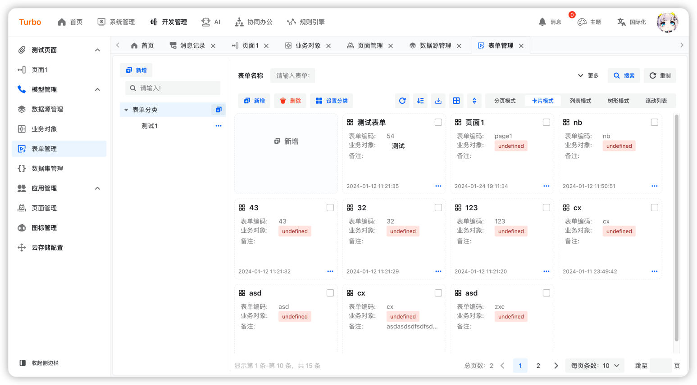

English | [简体中文](./README.md)

<h2 align="center">Simple · Practical · Leading Edge · Innovation</h2>

<h4 align="center">Based on the Java ecosystem, the latest technologies in the React ecosystem are dedicated to creating
comprehensive, one-stop solutions suitable for enterprise-level and internet marketing needs, tailored for future
trends.</h4>

## aim

- 🧃 Developer-friendly, clear code, and high readability.
- 🤖 Reducing operational costs, embracing cloud-native approaches comprehensively, supporting CI/CD, and implementing
  robust system monitoring solutions.
- 💪 An all-encompassing solution covering App, iOS, Mini Programs, HarmonyOS, and desktop applications within the entire
  ecosystem.
- ❤️User-oriented, featuring minimalist design to reduce redundant actions, increase efficiency, and prevent repetitive
  user experiences for enhanced usability.

## Feature

- **Fast:** Turbo places "fast" at its core, significantly enhancing development efficiency through features such as
  low-code and code generation, enabling developers to rapidly construct application systems.
- **Support for Multiple Data Categories and Sources:** The data abstraction layer based on uno-data enables developers
  to seamlessly integrate various data categories and multiple data sources without being aware of the integration
  process.
- **Data Source Agnostic:** Highly abstracted data operations allow developers to focus solely on business logic without
  needing to concern themselves with the differences in underlying data sources.
- **High Encapsulation:** Turbo draws inspiration from the design principles of Mybatis-Plus and JPA, adopting a highly
  encapsulated three-tier architecture (Controller-Service-Repository) along with concepts of domain events and
  behaviors. This approach achieves architectural uniformity and extensibility.
- **Business Domain Modeling:** Turbo supports business domain modeling, aiding developers in better organizing and
  managing business logic.
- **Unified Frontend:** Leveraging Alibaba's Formily and internally developed Tablily solutions, Turbo achieves
  uniformity across different ends, reducing the learning curve for developers by unifying **Form** and **Table**
  components.
- **RBAC Permission System:** Turbo offers a comprehensive RBAC (Role-Based Access Control) permission system, enabling
  developers to easily implement user permission management.
- **Supports the OAuth2.1:** Turbo supports the OAuth2.1 protocol, facilitating seamless integration with other systems.
- **Internationalization**: Turbo supports internationalization, making it convenient to implement multi-language
  support.
- **Multi-tenancy**: Supports multi-tenancy.
- **Visual, Configurable**: Provides visual form and table editors, configurable rules, and workflows.

## Built-in Features

- **Job Management**: Managing internal job positions within the organization.
- **Attachment Management**: Managing information regarding attachments within the system.
- **Tenant Management**: Managing under a multi-user system.
- **Dictionary Management**: Managing dictionary information within the system.
- **Role Management**: Managing role permissions, supporting multiple roles.
- **Menu Management**: Configuring system menus, displayed in a tree structure.
- **Organization Management**: Managing affiliated organizations.
- **User Management**: Managing system user data.
- **Message Management**: Configuring system message templates, setting up messaging, capable of receiving data from any
  messaging endpoint, and supporting message record queries.
- **System Parameters**: Managing system parameters.
- **Business Object**: Supports modeling of business objects and manages business objects.
- **Data Source Management**: Supports managing different types of data sources, various data sources, real-time
  effective changes, and provides visual data table operations.
- **Dataset Management**: Abstraction of data operations, providing management of business objects, external APIs, and
  SQL datasets.
- **Form Management**: Based on Alibaba's Designable, it supports form management and provides a visual form designer.
- **Page Management**: Quickly generate pages, supporting visual form design, table design, and page settings.
- **Icon Management**: Supports quick viewing of system icons.
- **Cloud Storage Configuration**: Supports OSS cloud storage provided by different cloud vendors.
- **Rule Engine**: Provides a visual, programmable rule engine.

### Back-end

| name                                                       | version |
|------------------------------------------------------------|---------|
| JDK                                                        | 21      |
| [SpringBoot](https://spring.io/projects/spring-boot#learn) | 3.4.0   |
| [Mybatis-Plus](https://baomidou.com/)                      | ~3.5.3  |
| [PostgreSQL](https://www.postgresql.org/)                  | ~16     |
| [OpenTelemetry](https://opentelemetry.io/)                 |         |
| [OpenObserve](https://openobserve.ai/)                     | ~0.14   |
| [uno](https://uno-pink.vercel.app/)                        | ~1.9    |
| [redis](https://redis.io/)                                 | ~6.0    |

### Front-end

| name                                            | version |
|-------------------------------------------------|---------|
| [React](https://zh-hans.react.dev/)             | 18.3.1  |
| [Typescript](https://www.typescriptlang.org/)   | 3.4.0   |
| [Semi](https://semi.design/)                    | 2.72.0  |
| [tailwindcss](https://tailwindcss.com/)         |         |
| [vite](https://vitejs.dev/)                     | ~6.0    |
| [OpenObserve](https://openobserve.ai/)          | ~0.14   |
| [react-router](https://reactrouter.com/en/main) |         |
| [axis](https://axios-http.com/)                 |         |
| [mobx](https://mobx.js.org/)                    |         |
| [formilyjs](https://formilyjs.org/)             | 2.3.2   |

### Mini-Program

| name                                | version |
|-------------------------------------|---------|
| [React](https://zh-hans.react.dev/) | 18.3.1  |
| [Taro](https://docs.taro.zone/)     |         |

### Mobile-end

| name                           | version |
|--------------------------------|---------|
| [Flutter](https://flutter.dev) |         |

### Desktop-end

| name                        | version |
|-----------------------------|---------|
| [tauri](https://tauri.app/) |         |

## preview

<table>
    <tr>
        <td></td>
        <td></td>
        <td></td>
    </tr>
    <tr>
        <td></td>
        <td></td>
        <td></td>
    </tr>
    <tr>
        <td></td>
        <td></td>
        <td></td>
    </tr>
</table>

