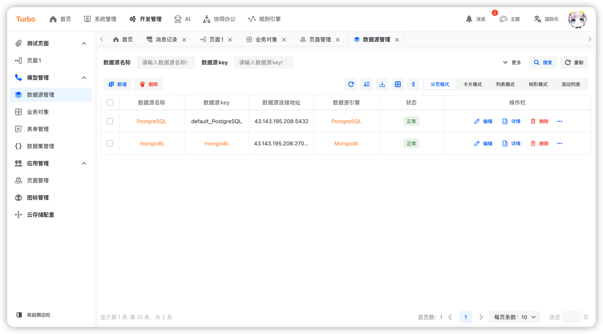

English | [简体中文](./README.md)

<h2 align="center">Simple · Practical · Leading Edge · Innovation</h2>

<h4 align="center">Based on the Java ecosystem, the latest technologies in the React ecosystem are dedicated to creating comprehensive, one-stop solutions suitable for enterprise-level and internet marketing needs, tailored for future trends.</h4>

## Target

- 🧃 Developer-friendly, clear code, and high readability.
- 🤖 Reducing operational costs, embracing cloud-native approaches comprehensively, supporting CI/CD, and implementing
  robust system monitoring solutions.
- 💪 An all-encompassing solution covering App, iOS, Mini Programs, HarmonyOS, and desktop applications within the entire
  ecosystem.
- ❤️User-oriented, featuring minimalist design to reduce redundant actions, increase efficiency, and prevent repetitive
  user experiences for enhanced usability.

## Feature

- 🚀**Fast:** Turbo places "fast" at its core, significantly enhancing development efficiency through features such as low-code and code generation, enabling developers to rapidly construct application systems.
- 🤙**Support for Multiple Data Categories and Sources:** The data abstraction layer based on uno-data enables developers to seamlessly integrate various data categories and multiple data sources without being aware of the integration process.
- ⚽**Data Source Agnostic:** Highly abstracted data operations allow developers to focus solely on business logic without needing to concern themselves with the differences in underlying data sources.
- 🎈**High Encapsulation:** Turbo draws inspiration from the design principles of Mybatis-Plus and JPA, adopting a highly encapsulated three-tier architecture (Controller-Service-Repository) along with concepts of domain events and behaviors. This approach achieves architectural uniformity and extensibility.
- 🌤**Business Domain Modeling:** Turbo supports business domain modeling, aiding developers in better organizing and managing business logic.
- 🍙**Unified Frontend:** Leveraging Alibaba's Formily and internally developed Tableily solutions, Turbo achieves uniformity across different ends, reducing the learning curve for developers by unifying **Form** and **Table** components.
- 🔒**RBAC Permission System:** Turbo offers a comprehensive RBAC (Role-Based Access Control) permission system, enabling developers to easily implement user permission management.
- 🖲**Supports the OAuth2.1:** Turbo supports the OAuth2.1 protocol, facilitating seamless integration with other systems.

### Back-end

1. JDK21+
2. springboot:3.2+
3. [uno:1.5+](https://github.com/ClearXs/uno)
4. mybatis-plus:3.5.3+
5. postgresql:14+
6. mysql:8+
7. opentelemetry
8. openobserve
9. redis:7+
10. kafka:3.0+
11. xxljob

### Front-end

1. [React](https://zh-hans.react.dev/)
2. [Typescript](https://www.typescriptlang.org/)
3. [Semui](https://semi.design/)
4. [tailwindcss](https://tailwindcss.com/)
5. [vite](https://vitejs.dev/)
6. [react-router](https://reactrouter.com/en/main)
7. [recoil](https://recoiljs.org/)
8. [axis](https://axios-http.com/)

### Mobile-end

1. [React](https://zh-hans.react.dev/)
2. [Taro](https://docs.taro.zone/)
3. [nutui](https://nutui.jd.com/#/)
4. sass
5. [react-router](https://reactrouter.com/en/main)
6. [react-redux](https://react-redux.js.org/)

### Desktop-end

1. [tauri](https://tauri.app/)

## preview

<table>
    <tr>
        <td></td>
        <td></td>
        <td></td>
    </tr>
    <tr>
        <td></td>
        <td></td>
        <td></td>
    </tr>
    <tr>
        <td></td>
        <td></td>
        <td></td>
    </tr>
</table>

