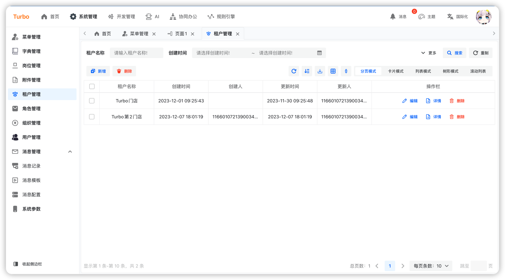
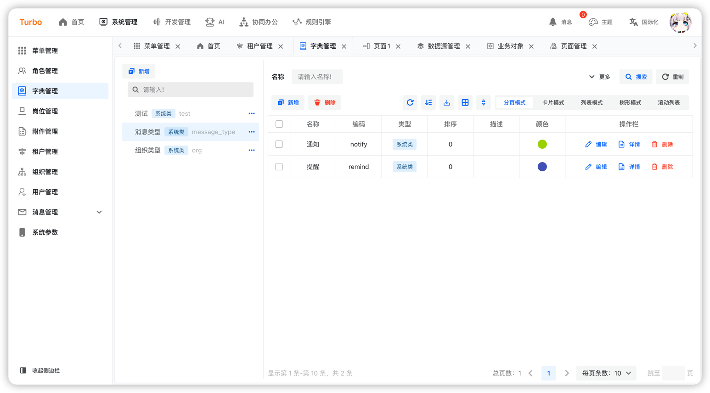

<h1 align="center">Turbo</h1>

<h2 align="center">简约 · 实用 · 前沿 · 创新</h2>

<h4 align="center">基于Java体系，React体系最新技术适合于企业级与互联网营销的一站式解决方案</h4>

## 背景

### 为什么出现Turbo

Turbo的定位是以最新技术来构建的一套快速开发框架，出发点是区别于市面上通用的技术体系，打造一套适合于未来趋势的企业级已经互联网营销的一站式解决方案。

Turbo融合各种轻量级的组件进行构建出一套：

- 对开发人员友好，代码清晰，可读性强。
- 减少运维成本，全面拥抱云原生，支持CI/CD以及完善的系统监控方案。
- 全生态解决方案，App、IOS、小程序、鸿蒙、桌面应用
- 对用户实用，简约风的设计、减少冗余操作，增加快捷操作，避免出现重复操作等带来用户差体验

## 架构

## 技术体系

### 后端技术体系

1. JDK21+
2. springboot:3.2+
3. [uno:1.5+](https://github.com/ClearXs/uno)
4. mybatis-plus:3.5.3+
5. postgresql:14+
6. mysql:8+
7. openobserve
8. skywalking
9. redis:7+
10. kafka:3.0+
11. xxljob

### 前端技术体系

1. 语言：[React](https://zh-hans.react.dev/)
2. [Typescript](https://www.typescriptlang.org/)
3. UI框架：[Semui](https://semi.design/)
4. css框架：[tailwindcss](https://tailwindcss.com/)
5. 包管理工具：[vite](https://vitejs.dev/)
6. 路由：[react-router](https://reactrouter.com/en/main)
7. 状态管理：[recoil](https://recoiljs.org/)
8. 请求框架：[axis](https://axios-http.com/)

### 跨端技术体系

1. 语言：[React](https://zh-hans.react.dev/)
2. 框架：[Taro](https://docs.taro.zone/)
3. UI框架：[nutui](https://nutui.jd.com/#/)
4. css：sass
5. 路由：[react-router](https://reactrouter.com/en/main)
6. 状态管理：[react-redux](https://react-redux.js.org/)

### 桌面端技术体系

## 界面预览

<table>
    <tr>
        <td></td>
        <td></td>
        <td></td>
    </tr>
    <tr>
        <td></td>
        <td></td>
        <td></td>
    </tr>
    <tr>
        <td></td>
        <td></td>
    </tr>
</table>

