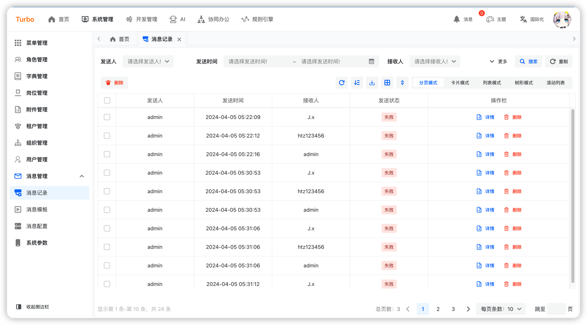

[English](README.en-US.md) | 简体中文


<h2 align="center">简约 · 实用 · 前沿 · 创新</h2>

<h4 align="center">基于Java体系，React体系最新技术致力于打造适合于未来趋势的企业级以及互联网营销的全端一站式解决方案</h4>

## 目标

- 🧃 对开发人员友好，代码清晰，可读性强。
- 🤖 减少运维成本，全面拥抱云原生，支持CI/CD以及完善的系统监控方案。
- 💪 全生态解决方案，App、IOS、小程序、鸿蒙、桌面应用。
- ❤️ 对用户实用，简约风的设计、减少冗余操作，增加快捷操作，避免出现重复操作等带来用户差体验。

## 特性

- **快**：Turbo以“快”为核心，通过低代码、代码生成等功能，可以大幅提升开发效率，帮助开发者快速构建应用系统。
- **多数据类别、多数据源支持**：基于uno-data的数据抽象层可以帮助开发者**无感知地集成**多种数据类别与多数据源。
- **数据源无关**：高度抽象的数据操作，使得开发人员**只关注业务逻辑**，无需在意底层数据源的差异。
- **高度封装**：Turbo借鉴了Mybatis-Plus、JPA的设计思路，采用了高度封装的三层架构（Controller-Service-Repository）以及领域事件与领域行为的概念，实现了架构的统一性和拓展性。
- **业务领域建模**：Turbo支持业务领域建模，可以帮助开发者更好地组织和管理业务逻辑。
- **全端统一**：基于阿里Formily及自研Tablily解决方案，Turbo实现了不同端**Form**和**Table**的统一，降低了开发人员的学习成本。
- **RBAC权限体系**：Turbo提供完善的RBAC权限体系，可以帮助开发者轻松实现用户权限管理。
- **支持OAuth2.1**：Turbo支持OAuth2.1 协议，可以方便地与其他系统进行对接。
- **国际化**: Turbo支持国际化，可以方便地实现多语言支持。
- **多租户**：支持多租户。
- **可视化、可编排**：提供可视化表单、表格编辑器，可编排的规则、流程。

## 支持功能

- **岗位管理**：对组织内部工作岗位进行管理。
- **附件管理**：对系统内附件信息进行管理。
- **租户管理**：管理多用户体系的下。
- **字典管理**：对系统内字典信息进行管理。
- **角色管理**：管理角色权限，支持多角色。
- **菜单管理**：配置系统菜单，树形展示。
- **组织管理**：管理所属组织。
- **用户管理**：管理系统用户数据。
- **消息管理**：配置系统消息模板，进行消息设置，可以接收任意消息端数据，并支持查询消息记录。
- **系统参数**：管理系统参数。
- **业务对象**：支持业务对象建模，并管理业务对象。
- **数据源管理**：支持管理不同类别数据源、不同数据源，支持实时更改生效，并提供可视化数据表操作。
- **数据集管理**：数据操作的抽象，提供业务对象，外部API、SQL的数据集管理。
- **表单管理**：基于阿里designable，支持表单管理，提供可视化表单设计器。
- **页面管理**：快速生成页面，支持可视化表单设计、表格设计、页面设置。
- **图标管理**：支持系统图标快速查看。
- **云存储配置**：支持不同云厂家提供的OSS云存储。
- **规则引擎**：提供可视化可编排的规则引擎。

### 后端技术体系

1. JDK22+
2. springboot:3.2+
3. [uno:1.5+](https://github.com/ClearXs/uno)
4. mybatis-plus:3.5.3+
5. postgresql:16+
6. mysql:8+
7. opentelemetry
8. openobserve
9. redis:7+
10. kafka:3.6+
11. xxljob

### 前端技术体系

1. 语言：[React](https://zh-hans.react.dev/)
2. [Typescript](https://www.typescriptlang.org/)
3. UI框架：[Semui](https://semi.design/)
4. css框架：[tailwindcss](https://tailwindcss.com/)
5. 包管理工具：[vite](https://vitejs.dev/)
6. 路由：[react-router](https://reactrouter.com/en/main)
7. 状态管理：[recoil](https://recoiljs.org/)
8. 请求框架：[axis](https://axios-http.com/)

### 跨端技术体系

1. 语言：[React](https://zh-hans.react.dev/)
2. 框架：[Taro](https://docs.taro.zone/)
3. UI框架：[nutui](https://nutui.jd.com/#/)
4. css：sass
5. 路由：[react-router](https://reactrouter.com/en/main)
6. 状态管理：[react-redux](https://react-redux.js.org/)

### 桌面端技术体系

1. 框架：[tauri](https://tauri.app/)

## 界面预览

<table>
    <tr>
        <td></td>
        <td></td>
        <td></td>
    </tr>
    <tr>
        <td></td>
        <td></td>
        <td></td>
    </tr>
    <tr>
        <td></td>
        <td></td>
      	<td></td>
    </tr>
</table>

## 运行

添加如下的jvm参数

```bash
--add-opens java.base/java.lang=ALL-UNNAMED
```

## roadmap

[@see](./docs/ROADMAP.md) 
